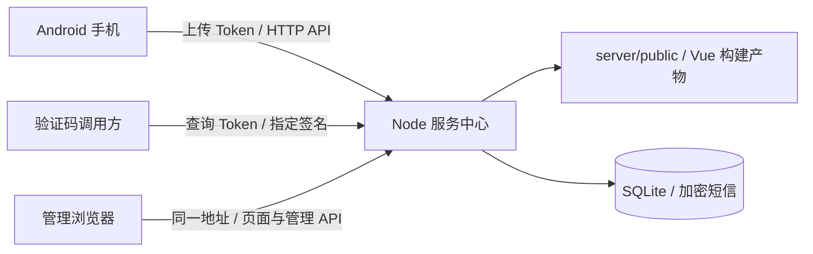

# 📖 短信中枢 · 完整使用指南

> [🏠 项目首页](README.md) · [🔌 API 文档](docs/API.md) · [🧪 验证记录](docs/VALIDATION.md)

本文介绍短信中枢的安装、初始化、Android 接入、接口调用、部署与维护。

手机 App 接收验证码短信，通过独立的上传凭证发送到服务中心；服务中心加密存储短信，并通过受 Token 权限控制的 API 返回指定签名的最新验证码。Vue 管理页面随 Node 服务一起发布，部署时只需启动一个 Node 进程。

> 当前为可联调的第一版。仅对本人拥有或已获得授权的设备开启采集；手机 App 会明确申请短信权限与采集授权。

## 目录

- [功能与架构](#功能与架构)
- [快速开始：单服务运行](#快速开始单服务运行)
- [初始化超级管理员](#初始化超级管理员)
- [安装 APK 与连接手机](#安装-apk-与连接手机)
- [调用验证码查询 API](#调用验证码查询-api)
- [配置说明](#配置说明)
- [开发、构建与测试](#开发构建与测试)
- [GitHub Actions 自动构建](#github-actions-自动构建)
- [Docker 与 HTTPS 部署](#docker-与-https-部署)
- [数据备份与升级](#数据备份与升级)
- [常见问题](#常见问题)
- [项目结构与当前边界](#项目结构与当前边界)

## 功能与架构

| 项目         | 技术                                    | 功能                                                                                          |
| ------------ | --------------------------------------- | --------------------------------------------------------------------------------------------- |
| Android App  | Kotlin / Android Keystore / WorkManager | 新短信接收、统计、服务连接配置、权限引导、加密离线队列、退避重试、手动导入历史验证码          |
| 短信服务中心 | Node.js / Express / SQLite              | 加密短信存储、签名识别、设备绑定上传 Token、签名/设备范围查询 Token、最新有效验证码查询、审计 |
| 管理页面     | Vue 3 / Vite                            | 概览、短信筛选与详情、设备管理、凭证分配/撤销、接口审计、识别规则、保留策略、密码管理         |



安全机制：

- 短信正文、验证码和发送号码使用 AES-256-GCM 加密；短信签名、设备、时间等索引元数据明文保存。
- 上传 Token 绑定单台设备；查询 Token 可限制签名和设备范围，支持过期与撤销，数据库只保存 Token 摘要。
- 超级管理员首次登录必须改密；管理会话使用 HttpOnly Cookie、CSRF 与来源校验，密码使用 scrypt。
- 短信列表默认隐藏验证码，查看明文会写入审计；审计不保存验证码、正文或完整 Token。
- 查询只返回允许范围内、有效期内、已启用设备的验证码。

## 快速开始：单服务运行

### 1. 环境要求

- Node.js **>=22.12.0**，建议使用 **Node 24**；仓库提供 `.nvmrc`。
- npm，依赖安装使用仓库根目录的 `package-lock.json`。
- 构建或运行服务不需要安装 Android SDK。

如果安装了 nvm：

```bash
nvm install
nvm use
```

### 2. 下载源码并安装依赖

克隆仓库并进入项目根目录（使用自己的 Fork 时替换仓库地址）：

```bash
git clone https://github.com/MSamor/SMS-Center.git
cd SMS-Center
npm ci
cp server/.env.example server/.env
```

Windows 可手动复制 `server/.env.example` 为 `server/.env`。

### 3. 构建管理页面

```bash
npm run build
```

构建脚本 `scripts/build.js` 执行两步：

1. 使用 Vite 打包 Vue，输出到 `admin/dist/`。
2. 把成功构建的产物复制到 `server/public/`，替换之前的静态页面。

构建失败不会删除原来的静态页面。`server/public/` 为生成目录，不提交到 Git；修改前端后需重新构建。

### 4. 启动唯一的服务

```bash
npm start
```

也可直接运行：

```bash
node server/src/index.js
```

浏览器打开 **http://localhost:3000**。管理页面、管理 API、手机上传 API 和验证码查询 API 都由同一 Node 服务提供，运行时不需要 Vite。

健康检查：

```bash
curl http://localhost:3000/api/health
```

默认数据目录为 `server/data/`。启动会自动创建 SQLite 数据库和加密密钥。首次启动的账号初始化方式见下一节。

## 初始化超级管理员

数据库中没有管理员时，服务自动初始化一个 `super_admin` 账号：

| 配置                  | 默认行为                                       |
| --------------------- | ---------------------------------------------- |
| `ADMIN_USERNAME`      | `admin`                                        |
| `ADMIN_PASSWORD` 留空 | 生成随机初始密码，仅在首次初始化的终端输出一次 |
| `ADMIN_PASSWORD` 有值 | 使用配置的初始密码，要求 12～256 个字符        |

可在首次启动前编辑 `server/.env`：

```dotenv
ADMIN_USERNAME=admin
ADMIN_PASSWORD=自行填写至少12字符的初始密码
```

初次使用流程：

1. 使用初始账号和密码登录管理页面。
2. 系统强制显示改密页面，输入初始密码、新密码和确认密码。
3. 新密码必须为 12～256 字符，且不能与初始密码相同。
4. 修改成功后全部旧登录会话失效，使用新密码重新登录，才能访问管理功能。

**此限制由后端强制执行。** 未改密的登录会话只能访问 `/me`、`/password`、`/logout`；访问短信、设备、凭证、审计、设置等接口会返回 `403 PASSWORD_CHANGE_REQUIRED`。刷新页面或直接访问 URL 不会绕过限制。

`ADMIN_USERNAME` 和 `ADMIN_PASSWORD` 只用于创建初始账号，修改环境变量或重启不会覆盖已有账号和密码。完成初始化后可从部署配置中移除初始密码。

从早期数据库版本升级时，已有账号、密码和短信保留；管理员自动补充 `super_admin` 角色，并要求完成一次密码修改。之后不会在每次启动时重复要求首次改密。

## 安装 APK 与连接手机

### 获取 APK

正式版本在仓库 **Releases → 对应版本 → Assets** 下载 `sms-center-vX.Y.Z.apk`，同时提供 `SHA256SUMS.txt`。发布前尚无版本时，可按照下面的命令在本地构建 Debug 测试包。自动发布说明见 [GitHub Actions](#github-actions-自动构建)。

也可以自行构建。需要 JDK 17（或兼容的 JDK 21）、Android SDK、Platform 35 和 Build Tools 35.0.0：

```bash
cd android
# 配置 ANDROID_HOME，或用 Android Studio 打开 android 目录
./gradlew :app:assembleDebug :app:lintDebug
```

Windows 使用 `gradlew.bat`。产物路径：

```text
android/app/build/outputs/apk/debug/app-debug.apk
```

ADB 安装到测试设备：

```bash
adb install -r -g android/app/build/outputs/apk/debug/app-debug.apk
```

APK 最低支持 Android 8.0（API 26）。本地 Debug 构建使用测试签名；版本发布使用维护者在 Secrets 中配置的固定签名。后续更新必须保留同一发布密钥。Debug 测试包与 Release 包可能签名不同，首次切换需卸载旧测试包；卸载会移除 App 本地配置与队列。

### 接入步骤

1. 在网页「设备管理」点击「添加设备」，填写名称。
2. 保存只显示一次的 `upl_` 上传 Token。
3. 打开手机 App 的「连接与设置」，填写 **服务根地址** 和上传 Token。
4. 保存并点击「验证服务与设备」。
5. 开启验证码采集，同意说明并授予短信接收、短信读取权限。新增短信会通过广播及短信库备用路径采集。
   - 小米 / Redmi / POCO：还需打开 App 内的「设置小米通知类短信权限」，进入「其他权限」，将「通知类短信」设为「始终允许」。这台 Android 16 小米真机在普通短信权限已允许、此项拒绝时无法补传验证码；允许后已验证补传上传成功。不同系统版本的名称和入口可能不同。
6. 允许后台采集通知。采集开启后会启动常驻前台服务，并显示「短信中枢：后台采集中」通知；可从通知或 App 开关停止采集。Android 13+ 可在 App 内授权通知权限。
7. 根据手机厂商设置后台运行、自启动与电池限制；小米还应锁定最近任务。
8. 收到验证码短信后，在 App 统计页检查上传状态，在网页「短信记录」查看入库结果。

地址示例：

| 场景                        | 服务地址                                                          |
| --------------------------- | ----------------------------------------------------------------- |
| 同一局域网的真实手机        | `http://192.168.1.10:3000`，替换为服务电脑的局域网 IP             |
| Android 模拟器访问宿主机    | `http://10.0.2.2:3000`                                            |
| 模拟器使用 ADB 端口反向代理 | 执行 `adb reverse tcp:3000 tcp:3000` 后填 `http://127.0.0.1:3000` |
| 公网部署                    | `https://sms.example.com`，替换为自己的域名                       |

地址不包含 `/api`，真实手机不能填写电脑的 `localhost`。确保手机能访问该地址、服务监听对应网卡且防火墙放行端口。公网部署使用 HTTPS。

默认只处理开启采集后的新短信。需要历史短信时，手动点击「导入最近 24 小时验证码」，单独授权 READ_SMS；最多扫描最近 500 条短信。普通短信不作为验证码存储。

App 先按关键词筛选候选，服务端最终提取验证码。默认支持关键词附近的 4～8 位数字；特殊格式可以在网页配置签名规则，在 App 配置额外采集关键词。自定义规则可支持 4～10 位字母数字（至少含一位数字），仅影响之后上传的短信。

## 调用验证码查询 API

### 创建查询凭证

在网页「访问凭证」创建查询 Token：

- 指定允许查询的短信签名，例如 `示例服务`。
- 可限制设备范围；不选择设备表示全部设备。
- 可指定到期时间。
- 完整 `qry_` Token 只显示一次，关闭后无法再次查看。

上传 Token 和查询 Token 不能混用。签名精确匹配，不包含 `【】`：`【示例服务】验证码…` 对应 `signature=示例服务`。

### 获取最新验证码

```bash
curl -G 'http://localhost:3000/api/v1/codes/latest' \
  -H 'Authorization: Bearer YOUR_QUERY_TOKEN' \
  --data-urlencode 'signature=示例服务'
```

成功响应：

```json
{
  "data": {
    "id": "消息UUID",
    "signature": "示例服务",
    "code": "123456",
    "sender": "10690001",
    "deviceId": "设备UUID",
    "receivedAt": 1791360000000,
    "expiresAt": 1791360600000
  }
}
```

可选参数 `deviceId` 限制来源设备，`maxAgeSeconds` 缩短查询有效期。默认有效期 600 秒；调用方不能通过参数扩大服务端的有效期设置。“最新”按短信接收时间排序，上传时间用于同时间排序。

### 上传接口

```bash
curl -X POST 'http://localhost:3000/api/v1/sms' \
  -H 'Authorization: Bearer YOUR_UPLOAD_TOKEN' \
  -H 'Content-Type: application/json' \
  -d '{"clientMessageId":"test-message-001","sender":"10690001","body":"【示例服务】验证码123456","receivedAt":1791360000000}'
```

手动测试时请把 `receivedAt` 替换为当前 Unix 毫秒时间。设备由 Token 绑定，签名和验证码由服务端提取；相同设备和 `clientMessageId` 重试不会重复入库。

| 状态                       | 常见原因                                |
| -------------------------- | --------------------------------------- |
| `401`                      | 未提供 Token、Token 无效、已过期或撤销  |
| `403`                      | Token 类型错误、签名/设备越权或设备停用 |
| `404 CODE_NOT_FOUND`       | 允许范围内没有有效期内的验证码          |
| `422 NO_CODE`              | 未识别到验证码，检查短信格式与识别规则  |
| `422 INVALID_MESSAGE_TIME` | 短信时间超出允许范围，检查设备时钟      |
| `429`                      | 请求超过限流                            |

完整字段、管理 API 和错误码见 [docs/API.md](docs/API.md)。Token 通过 Authorization 传递，不写入 URL。

## 配置说明

服务端自动读取 **`server/.env`**；外部环境变量优先。Compose 读取根目录 **`.env`** 作为变量替换，两者用途不同。

| 变量             | 默认值                                   | 说明                                                                             |
| ---------------- | ---------------------------------------- | -------------------------------------------------------------------------------- |
| `PORT`           | `3000`                                   | 页面和 API 的唯一监听端口                                                        |
| `HOST`           | `0.0.0.0`                                | 监听地址                                                                         |
| `NODE_ENV`       | 未设置时按开发模式                       | 生产部署设置 `production`                                                        |
| `DATA_DIR`       | `./data`                                 | 相对于 server 目录，也支持绝对路径                                               |
| `ADMIN_USERNAME` | `admin`                                  | 仅首次初始化超级管理员使用                                                       |
| `ADMIN_PASSWORD` | 留空                                     | 留空生成随机初始密码；有值需 12～256 字符；必须在首次登录修改                    |
| `ENCRYPTION_KEY` | 自动生成文件                             | 可选，32 字节 Base64 密钥；不可替换已有数据使用的密钥                            |
| `ADMIN_ORIGINS`  | 本机 3000/5173 的 localhost 与 127.0.0.1 | 逗号分隔的浏览器 Origin，包含协议、主机、端口；生产环境必须显式配置 HTTPS Origin |
| `TRUST_PROXY`    | `0`                                      | 仅单层可信反向代理环境设置 `1`                                                   |
| `SESSION_HOURS`  | `12`                                     | 管理登录有效小时数，范围 1～168                                                  |

用局域网 IP 访问管理页时，需要把其浏览器 Origin 加入白名单，例如：

```dotenv
ADMIN_ORIGINS=http://localhost:3000,http://127.0.0.1:3000,http://192.168.1.10:3000
```

管理页面「系统设置」可修改短信保留天数、审计保留天数和验证码查询有效期。默认分别为 30 天、90 天、600 秒；缩短保留期会立即清理超期数据。

## 开发、构建与测试

```bash
npm ci
npm run dev
```

开发模式为了热更新启动两个进程：Node 在 3000，Vite 在 5173，管理页面使用 `http://localhost:5173`。**这是开发模式；构建后的部署只运行 Node。**

| 命令                   | 用途                                           |
| ---------------------- | ---------------------------------------------- |
| `npm run build`        | Vue 构建并复制到 server/public                 |
| `npm run build:admin`  | 仅构建 Vue 到 admin/dist，不更新 Node 静态目录 |
| `npm start`            | 单 Node 服务，提供页面与 API                   |
| `npm run dev`          | 本地 Node/Vue 热更新                           |
| `npm test`             | 服务端集成测试、初始改密与数据库迁移测试       |
| `npm run test:e2e`     | 构建单服务产物，运行浏览器全链路测试           |
| `npm run check`        | 服务端测试和完整构建                           |
| `npm run format:check` | 检查源码与工作流格式                           |

浏览器测试在 macOS 优先使用已安装的 Google Chrome；其他环境先安装 Playwright Chromium：

```bash
npx playwright install --with-deps chromium
npm run test:e2e
```

测试使用独立临时 SQLite，不操作正式数据；其中固定密码只用于测试服务。浏览器测试覆盖首次登录强制改密、刷新仍被限制、改密重新登录、设备创建、短信上传、凭证生成、查询、审计和手机布局。

Android 构建检查：

```bash
cd android
./gradlew :app:assembleDebug :app:lintDebug
```

模拟器短信链路复现步骤和验证边界见 [docs/VALIDATION.md](docs/VALIDATION.md)。

## GitHub Actions 自动构建

仓库只保留 [Publish Release](.github/workflows/release.yml) 一个工作流，**仅推送 `v*` 版本标签时触发**。普通分支推送、PR 和手动操作不触发构建。

发布工作流包含格式检查、Node 测试、Vue 构建、浏览器联调、签名 APK 构建、Docker Hub 镜像推送和 GitHub Release 发布，不再重复运行独立的 Build and Test 工作流。

### 配置发布凭证

在 **Settings → Secrets and variables → Actions → Secrets** 配置：

| Secret                      | 内容                                |
| --------------------------- | ----------------------------------- |
| `ANDROID_KEYSTORE_BASE64`   | 固定发布密钥库的 Base64 内容        |
| `ANDROID_KEYSTORE_PASSWORD` | 密钥库密码                          |
| `ANDROID_KEY_ALIAS`         | 签名别名                            |
| `ANDROID_KEY_PASSWORD`      | 签名密钥密码                        |
| `DOCKERHUB_USERNAME`        | Docker Hub 用户名                   |
| `DOCKERHUB_TOKEN`           | 拥有目标仓库 Write 权限的访问 Token |

在同页面 **Variables** 配置 `DOCKERHUB_IMAGE`，例如 `yourname/sms-center`，使用小写，不包含 `docker.io/`、标签或 digest。提前创建 Docker Hub 仓库，需要公开下载时设置为 Public。凭证不会写入源码，APK 密钥在 runner 临时目录恢复，任务结束时清理。

GitHub Release 使用内置 `GITHUB_TOKEN`，无需另建 GitHub PAT；只有发布任务授予 `contents: write`。普通分支推送和 PR 不运行发布流程。第三方 Actions 固定到 commit SHA。

### 发布版本

先提交并推送代码及工作流，再对该提交创建标签：

```bash
git tag -a v1.0.0 -m "SMS Center v1.0.0"
git push origin v1.0.0
```

所有发布构建使用标签指向的同一个 commit。工作流不提供手动 Run workflow 入口；失败后可在原运行页面使用 Re-run jobs 重试。

支持 `v1.2.3` 正式版本及 `v1.2.3-alpha.1`、`v1.2.3-beta.1`、`v1.2.3-rc.1` 预发布。当前映射支持 major 0～199、minor/patch 0～99、预发布序号 1～199，不支持其他后缀或 build metadata。APK `versionName` 为去掉 v 的版本；`versionCode` 使用以下确定性映射：

```text
major × 10000000 + minor × 100000 + patch × 1000 + 阶段序号
alpha.N = N；beta.N = 200 + N；rc.N = 400 + N；正式版 = 999
```

同一版本重跑编号保持不变，正式版编号高于同版本预发布，后续版本编号递增。

发布顺序：

1. 校验标签、镜像名和所有凭证是否存在；已公开的 Release 禁止覆盖，修改后发布新版本。
2. 运行格式检查、服务端和发布脚本测试、Vue 构建、浏览器联调。
3. 使用固定签名构建并检查 APK，生成 SHA256 校验文件。
4. 使用 Dockerfile 构建完整 Vue + Node 镜像，在 amd64 上检查页面和数据库健康，再推送 amd64/arm64 多架构镜像。
5. 生成 Release 说明，创建或更新草稿，上传 APK、校验文件和发布用 Compose。
6. 正式版将镜像 digest 标记为 latest；预发布不更新 latest。最后公开 Release。

### 下载与发布说明

Release 的 Assets 包含：

- `sms-center-vX.Y.Z.apk`：固定签名的 Android Release APK。
- `SHA256SUMS.txt`：APK 和 Compose 附件校验值。
- `compose.release.yaml`：直接拉取镜像的部署配置。

说明自动组合 GitHub 变更记录和安装指南，列出 APK 版本、镜像标签/digest、首次改密、设备接入、数据备份和升级注意事项。文档链接固定到对应版本标签。

镜像标签为 `DOCKERHUB_IMAGE:X.Y.Z`（不含 v）。正式版同时更新 `latest`，含义为最近一次成功发布的正式版本；生产环境推荐固定版本或 digest，不依赖 latest。请按版本递增顺序发布，避免后发布旧版本将 latest 指向旧版本。

发布过程的 APK 中间产物和失败报告在 Artifacts 保留 14 天。用户直接从 Release 下载最终附件，不使用这项 14 天自动过期设置。

### 失败重跑

公开 Release 前失败，可以重跑同一标签：草稿和附件会更新，已推送的版本镜像可能重新构建。已公开版本不能通过该工作流覆盖；使用新标签发布修复版本。Docker Hub 推送、latest 更新与 GitHub Release 不是原子事务，失败时可能留下版本镜像或草稿，需查看 Actions 日志确认状态。

本地检查不能证明远端 Secrets 有效；首次发布必须在 GitHub 实际运行后确认 APK 附件与 Docker Hub 镜像都可下载。

## Docker 与 HTTPS 部署

### 使用发布镜像（推荐）

从 Release 下载 `compose.release.yaml` 保存为部署目录中的 `compose.yaml`，或者从源码复制该文件。创建 `.env`：

```dotenv
SMS_CENTER_IMAGE=yourname/sms-center:1.0.0
ADMIN_USERNAME=admin
ADMIN_PASSWORD=
ADMIN_ORIGINS=https://sms.example.com
```

镜像名和版本使用 Release 说明中的实际值，域名替换为自己的 HTTPS 域名：

```bash
docker compose pull
docker compose up -d
docker compose logs sms-center
```

此方式不需要在部署服务器安装 Node、Android SDK 或构建 Vue。

### 从源码构建镜像

镜像使用相同构建脚本，Vue 产物放入 `server/public`，运行层只启动 Node。

在项目根目录创建 `.env`：

```dotenv
ADMIN_USERNAME=admin
# 可留空：首启随机生成并从容器日志获取；也可填写12～256字符的初始密码
ADMIN_PASSWORD=
ADMIN_ORIGINS=https://sms.example.com
```

将域名替换为自己的域名，随后：

```bash
docker compose up -d --build
docker compose logs sms-center
```

首次登录后仍必须修改初始密码。容器使用持久卷 `sms-data`，数据库和密钥在 `/app/server/data/`。

Compose 将 Node 绑定到宿主机 **`127.0.0.1:3000`**，配置 HTTPS 反向代理后再对外提供访问。可参考 [deploy/Caddyfile.example](deploy/Caddyfile.example)：

```caddyfile
sms.example.com {
    reverse_proxy 127.0.0.1:3000
    header {
        -Server
    }
}
```

示例适用于 Caddy 在宿主机运行的情况；如 Caddy 在其他容器中运行，需调整端口、网络与上游地址。`TRUST_PROXY=1` 仅用于单层可信代理，不能在 Node 端口向不可信客户端开放时随意启用。

也可以直接安装 Node 部署：

```bash
npm ci
npm run build
# 在 server/.env 设置生产环境、HTTPS Origin 等配置
npm start
```

生产环境会使用 Secure 管理 Cookie，需通过 HTTPS 域名登录。部署时由进程管理器或容器重启策略维持 Node 服务。

## 数据备份与升级

- 默认数据为 `server/data/sms-center.sqlite`，密钥为 `server/data/encryption.key`。
- **数据库和原始密钥必须一起备份。** 设置 `ENCRYPTION_KEY` 时也须保存原始环境密钥。
- 推荐停服后备份整个数据目录/持久卷；不要只拷贝运行中的 SQLite 主文件，WAL 可能尚未合并。
- 恢复时使用原始密钥。密钥缺失或不匹配时服务拒绝打开数据，不会重新生成密钥覆盖已有数据。
- 升级前先备份，更新源码、安装依赖、执行 `npm run build`，然后重启 Node。
- 数据结构升级在启动时迁移；初始账号环境变量不会覆盖已有账号。
- 忘记密码时，修改 `ADMIN_PASSWORD` 不会重置账号。当前没有自助找回/重置 CLI；请保留可用管理员凭证，不要删除数据库来尝试修复密码。

App 的加密队列最多保留 30 天，上传成功后移除本地原文。关闭采集会取消后台上传，已排队数据仍加密保留，重新开启后继续处理；卸载会移除 App 的本地配置与数据。

## 常见问题

### 启动 Node 后提示页面尚未构建

在仓库根目录执行 `npm run build`，确认 `server/public/index.html` 存在，再重启 Node。仅执行 `npm run build:admin` 不会更新 Node 静态目录。

### Node 18 安装失败

项目需要 Node >=22.12.0，建议切换到 `.nvmrc` 指定的 Node 24 后重新执行 `npm ci`。

### 登录成功却无法访问管理接口

如果返回 `PASSWORD_CHANGE_REQUIRED`，先完成初始改密。如果返回 `ORIGIN_DENIED`，检查浏览器访问地址是否在 `ADMIN_ORIGINS` 中；修改配置后重启服务。

### 手机无法连接服务

确认使用手机能访问的 IP/域名、地址不带 `/api`、服务监听与防火墙配置正确。公网证书必须有效。App 的「验证服务与设备」可以区分凭证拒绝和网络访问失败。

### 手机能收到短信，但 App 没有记录

先在「连接与设置」中检查采集开关和短信权限，再点击「导入最近 24 小时验证码」。补传结果会显示读取、命中、新增、重复数量，并保留最近一次结果：

- **读取为 0**：最近 24 小时没有可读短信，或系统 / 厂商权限过滤了短信。
- **读到短信但命中为 0**：检查验证码关键词和数字；也可能只有普通短信可读，验证码短信被厂商权限隐藏。
- **命中但全部重复**：已在本地队列中，去「接收统计」检查上传状态。
- **新增大于 0**：已入队，继续检查上传结果；新增不等于上传成功。

小米 / Redmi / POCO 请额外检查「应用权限 → 其他权限 → 通知类短信 → 始终允许」。仅看到普通短信权限已授权不足以确认验证码短信可读。在当前小米 Android 16 真机上，开启该权限后补传成功。无需修改服务器、Docker 挂载或筛选关键词来解决这项权限拦截。

补传仅扫描过去 24 小时、最多 500 条短信，不会自动读取全部历史记录。检查短信是否包含验证码关键词。侧载短信权限可能受安装器和系统限制；先用授权的测试设备验证。App 不是通知监听器，不读取聊天软件通知中的验证码。

### 前台正常，切到后台后没有自动上传

开启采集时 App 使用带常驻通知的前台服务保持接收进程，并在服务内运行时注册短信接收器；Manifest 接收器保留为备用。小米真机上已观察到静态接收器 `SKIPPED / Greezer Denial`，且增加运行时接收器仍漏收，因此不能仅凭服务运行或接收器注册判断广播已交付。

服务还会监听短信库变化，并每 5 秒检查开启采集后的新增收件箱记录，需要 `READ_SMS`。这条备用路径不依赖短信广播，命中候选后同样立即上传并安排失败重试。默认省电模式不保持 CPU 唤醒；前台服务仍在不代表定时检查一直执行，深度休眠或厂商调度可能暂停读取和上传。

如果作为专用实时验证码手机，在「连接与设置」开启 **持续实时采集（较高耗电）** 并确认说明。采集服务会持有 `PARTIAL_WAKE_LOCK` 保持 CPU 唤醒，不点亮屏幕；每次租约 10 分钟，5 分钟续租。关闭实时模式、关闭采集或服务销毁立即释放，异常未续租则到期释放。模式默认关闭，设置会持久保存，通知明确显示实时 / 省电模式。持续唤醒会增加耗电，建议专用手机接电使用。

这不是厂商冻结豁免或网络权限：仍需允许自启动、通知类短信、后台不受限制；Doze 网络限制需要电池优化豁免，系统强行停止 / OEM 冻结时仍可能中断。统计页显示 App 的 CPU 唤醒锁申请状态（不代表厂商未禁用）、最近 / 最长读取间隔和最近上传请求，可区分读取线程停顿与网络上传失败。关闭采集会停止监听和检查。

首次升级到此机制且采集已开启时，补查最近一次本地记录之后、最多过去 24 小时的漏收短信；无本地记录时从当前时间开始。重新开启采集则从开启时间开始，更多历史短信仍需手动补传。

广播与短信库的时间戳可能略有不同，同一发送者、相同正文、时间差 5 秒以内按同一条去重；该窗口内真实重复发送的相同短信也会合并。本地使用 Android Keystore HMAC 指纹去重，上传完成仍移除原文。短信广播到达后，先加密入队并持久化备用上传任务，再立即尝试 HTTP 上传（整次请求最多 6 秒）；广播最多保留 8 秒。失败时 Android 12+ 会请求加急 WorkManager 上传，配额不足时降为普通任务；低版本使用普通重试任务。周期任务作为补偿，不再作为实时上传的唯一入口。

1. 在统计页确认「后台服务：运行中」「常驻短信接收：已注册」，并检查「短信库检查」时间是否持续更新。允许通知权限，并在通知栏检查「短信中枢：后台采集中」。重新打开 App 会刷新常驻通知。
2. 小米确认自启动、通知类短信权限已允许，电池策略不受限制；按需锁定最近任务。
3. 将 App 切到后台后接收一条新验证码，再查看统计页的「最近广播」和「最近接收入口」。没有新的广播时间说明广播可能未交付；查看短信库检查和接收入口，确认备用路径是否发现短信；显示已入队但上传失败时检查网络、Token 和服务地址。
4. 「最近广播」显示处理完成时仍需查看已上传 / 已拒绝统计；服务拒绝不等于上传成功。

正常后台和息屏状态下会立即尝试上传；断网、厂商冻结、用户强行停止、系统终止或 Android 调度限制仍可能造成延迟，不能承诺所有机型的固定秒级时限。强行停止后需重新打开 App。开机 / 覆盖更新会尝试恢复此前已启用的采集，系统拒绝启动时需打开 App。

### 待上传记录一直未上传

查看错误提示、Token 是否被撤销、设备是否停用以及服务可达性。网络/服务故障会退避重试；配置修正后点击「立即尝试上传」。App 会直接尝试访问配置的服务地址，支持无法连接公网的局域网场景。

### 查询返回 404，但管理页能看到短信

检查短信是否超过查询有效期、设备是否停用，以及 Token 的设备范围。管理列表保留期与验证码查询有效期不同，历史记录不保证仍可通过查询接口返回。

### 后台短信或上传不及时

Android 和厂商省电策略会影响调度。允许自启动、后台运行并根据厂商要求锁定最近任务。系统强行停止 App 后需手动重新打开；不能保证实时上传。

## 项目结构与当前边界

```text
SMS-Center/
├── .github/workflows/         # 仅版本标签触发的 APK / Docker Hub / Release 发布
├── android/                   # 原生 Android App 与 Gradle Wrapper
├── admin/                     # Vue 源码；dist 为构建输出
├── server/
│   ├── src/                   # Node API、加密、数据库与初始化
│   ├── test/                  # API、安全、初始化与迁移测试
│   ├── public/                # 构建脚本生成，Node 直接托管
│   ├── data/                  # 数据库和密钥，不提交 Git
│   └── .env.example           # 服务配置示例
├── scripts/                   # 页面构建、发布版本处理、Release 说明与测试
├── e2e/                       # 浏览器联调
├── docs/                      # API 与验证记录
├── Dockerfile
├── compose.yaml               # 从源码构建
└── compose.release.yaml       # 直接拉取发布镜像
```

当前未实现：管理员多角色分配、密码找回、密钥轮换、自动备份、分布式多实例、APK 自动更新、应用商店审核。Android 13+ 侧载权限、各厂商自启动入口和长时间后台行为仍需目标真机验证。

贡献时请避免提交 `.env`、数据文件、密钥、签名文件和业务 Token；提交变更前运行 `npm run check` 与相关联调。开源许可证由维护者在仓库的 `LICENSE` 中声明；当前代码尚未附加许可证文件。

### 小米前台服务仍在，但等一会儿停止上传、打开 App 才补传

前台服务存在、Android 电池优化豁免、唤醒锁 `isHeld` 都不能证明厂商没有冻结进程。在本项目的小米 Android 16 真机上已捕获 `Greezer Denial`、`FZ ... reason : tobg`，以及 `Partial wakeLock ... disabled: true ... reason: greeze`。此时服务记录仍然存在，但短信广播、短信库检查及网络上传可能同时停止。

请同时检查小米应用省电策略和 Android 电池优化，不要只检查后者。App 显示小米 `MILLET_NO_RESTRICT_APP` 是否包含本应用的精确包名；这只用于诊断，不会自行修改系统名单。

本次真机原名单中的目标条目为 ` com.smscenter.app`（前导空格）。通过 ADB 保留全部原有包名、去除分隔空格并刷新名单后，观察到唤醒锁从 `DISABLED` 恢复有效，息屏读取检查恢复约 5 秒间隔。这里只证明该手机上的前后变化，不保证所有 HyperOS 版本都采用同一解析方式，也不保证云控不会重写配置。修改前已保存本地回退副本；正常优先通过系统「不限制」页面配置。

如果仍有延迟，记录短信到达时间、统计页的最长检查间隔、最近请求时间和 HTTP 结果。检查时间出现大跳跃且打开 App 才恢复，优先排查调度 / 厂商冻结；检查持续更新且已有 pending / 上传错误，则排查网络和服务端。持续实时模式也不能解除厂商强制冻结。
