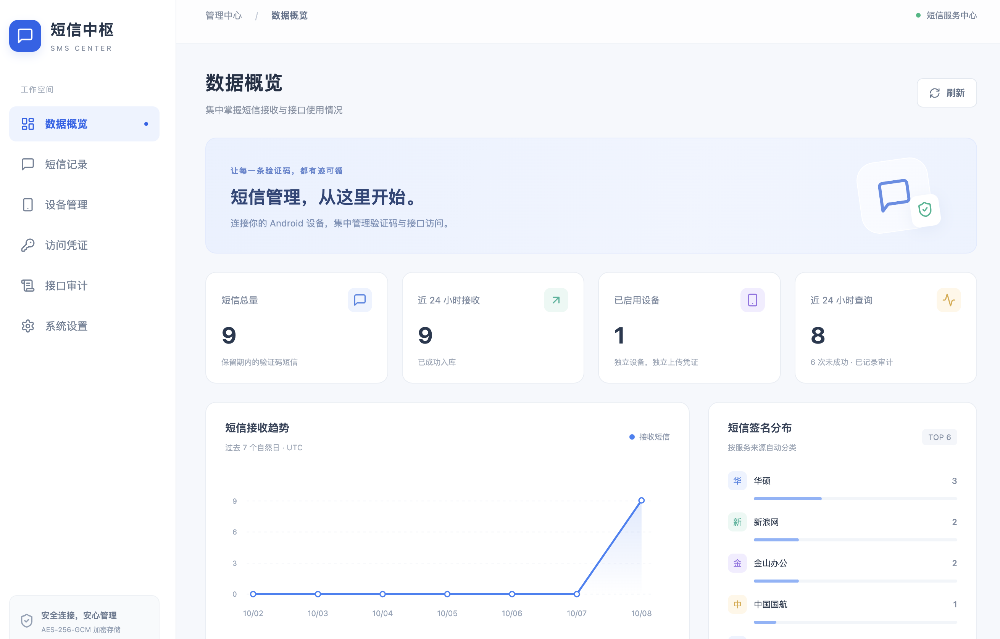
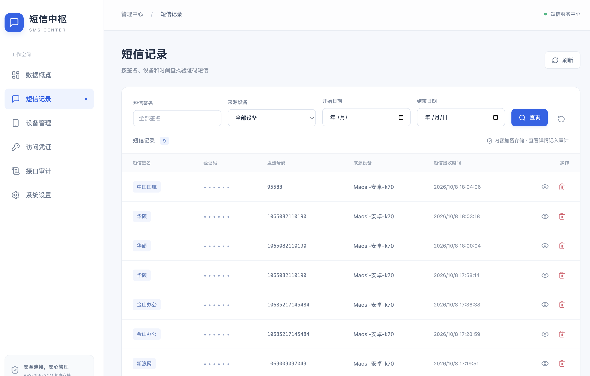
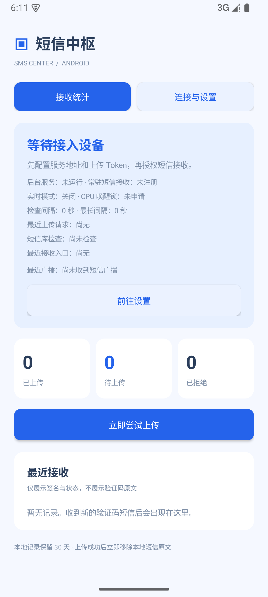
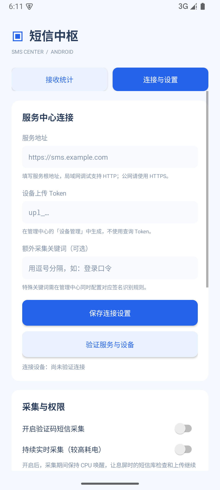

<div align="center">

# 💬 SMS Center · 短信中枢

**一站式 Android 验证码采集、加密存储与查询平台**


[📖 完整使用指南](README-SMS.md) · [🔌 API 文档](docs/API.md) · [📦 下载 APK](https://github.com/MSamor/SMS-Center/releases) · [🐛 问题反馈](https://github.com/MSamor/SMS-Center/issues)

</div>

---

集中采集 Android 验证码短信，支持加密存储、设备管理和 Token 授权查询。

## 🚀 快速开始

### Docker 部署（推荐）

镜像：`msamor/sms-center:latest`。

```bash
docker pull msamor/sms-center:latest
```

从 [Releases](https://github.com/MSamor/SMS-Center/releases) 下载 `compose.release.yaml`，保存为 `compose.yaml`。在同目录创建 `.env`，只需配置：

```dotenv
SMS_CENTER_IMAGE=msamor/sms-center:latest
ADMIN_ORIGINS=https://sms.example.com
```

将 `ADMIN_ORIGINS` 替换为实际访问的 HTTPS 地址（不含路径），然后启动：

```bash
docker compose up -d
docker compose logs sms-center
```

> **Docker 部署后必须通过 HTTPS 访问管理中心。** 配置 HTTPS 反向代理，将域名转发到宿主机 `127.0.0.1:3000`，再访问自己的 HTTPS 域名。代理配置见 [部署指南](README-SMS.md#docker-与-https-部署)。

默认账号为 `admin`，初始密码从容器日志获取，首次登录后必须修改密码。

### 本地运行

需要 Node.js ≥22.12.0。

```bash
git clone https://github.com/MSamor/SMS-Center.git
cd SMS-Center
npm ci
cp server/.env.example server/.env
npm run build
npm start
```

访问 **http://localhost:3000**，使用 `admin` 和终端显示的初始密码登录。

## 📱 连接手机

1. 从 [Releases](https://github.com/MSamor/SMS-Center/releases) 下载并安装 APK。
2. 在管理中心添加设备，获取上传 Token。
3. 在 App 中填写服务地址和上传 Token，授权短信权限并开启采集。

需要通过 API 查询验证码时，在管理中心创建查询 Token，参见 [API 文档](docs/API.md)。

## 🖼️ 界面预览

**管理中心 · 数据概览**



**管理中心 · 短信记录**



**Android App**（首次接入状态）

| 接收统计                                                                       | 连接与设置                                                                     |
| ------------------------------------------------------------------------------ | ------------------------------------------------------------------------------ |
|  |  |

## 📚 更多文档

- [完整使用指南](README-SMS.md)：详细配置、HTTPS 部署、备份与常见问题。
- [API 文档](docs/API.md)：短信上传、验证码查询与 Token 权限。
- [验证记录](docs/VALIDATION.md)：已执行的检查与验证边界。
